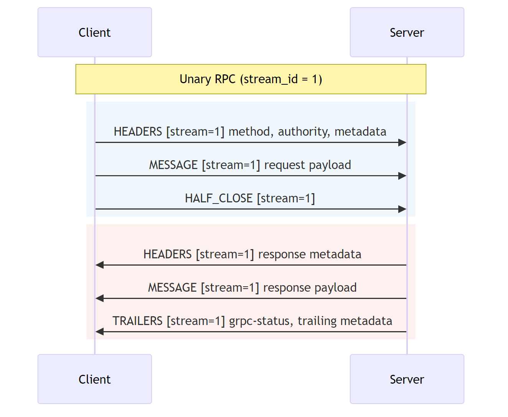
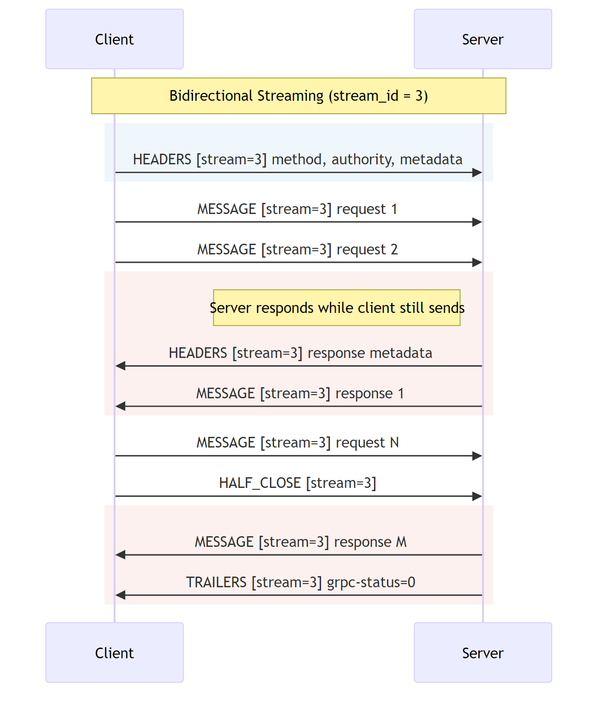

G3: Shared Memory Transport for gRPC
----
* Author(s): Mark Russinovich, Qiming Sun
* Approver: a11r
* Status: Draft
* Implemented in: n/a
* Last updated: 2026-03-26
* Discussion at: (TBD)

## Abstract

This proposal defines a protocol for gRPC over shared memory, for
inter-process calls on the same host. Two processes map the same memory
region and exchange gRPC frames through SPSC (single-producer /
single-consumer) ring buffers, using OS address-wait/wake primitives for
synchronization.

## Background

gRPC uses HTTP/2 over TCP. When both the client and server are on the same
host, the TCP path still traverses the full kernel networking stack — socket
buffers, TCP state machine, congestion control — which is unnecessary for
local IPC.

Shared memory lets two processes read and write the same physical pages
directly. This document specifies a framing protocol, metadata encoding,
and connection lifecycle for gRPC over shared memory.

### Related Proposals:

n/a

## Proposal

### Design Overview

Each SHM connection consists of a single memory-mapped segment containing two
unidirectional SPSC ring buffers:

- **Ring A**: Client → Server
- **Ring B**: Server → Client

The client writes to Ring A and reads from Ring B; the server does the
reverse. All multi-byte integers in the protocol are **little-endian**.

Stream multiplexing, flow control, and keepalive follow the same semantic
model as
[gRPC over HTTP/2](https://github.com/grpc/grpc/blob/master/doc/PROTOCOL-HTTP2.md)
and [RFC 7540](https://httpwg.org/specs/rfc7540.html). Only the wire
encoding differs; behavioral semantics are inherited.

gRPC
[Length-Prefixed-Message](https://github.com/grpc/grpc/blob/master/doc/PROTOCOL-HTTP2.md)
encoding, status codes, metadata conventions, and compression negotiation
apply without modification.


## Shared Memory Segment Layout

### Segment Header (128 bytes)

The segment header resides at offset 0 of the mapped region.

| Offset | Size | Field | Description |
|--------|------|-------|-------------|
| 0x00 | 8B | Magic | Fixed value `"GRPCSHM\0"` (0x47 52 50 43 53 48 4D 00) |
| 0x08 | 4B | Version | Protocol version (current = 1) |
| 0x0C | 4B | Flags | Reserved; MUST be 0 |
| 0x10 | 8B | TotalSize | Total mapped region size in bytes |
| 0x18 | 8B | RingAOffset | Byte offset to Ring A header |
| 0x20 | 8B | RingACapacity | Ring A data area capacity; MUST be a power of 2 |
| 0x28 | 8B | RingBOffset | Byte offset to Ring B header |
| 0x30 | 8B | RingBCapacity | Ring B data area capacity; MUST be a power of 2 |
| 0x38 | 4B | ServerPID | Server process ID |
| 0x3C | 4B | ClientPID | Client process ID |
| 0x40 | 4B | ServerReady | Server ready flag (0 or 1) |
| 0x44 | 4B | ClientReady | Client ready flag (0 or 1) |
| 0x48 | 4B | Closed | Connection closed flag (0 or 1) |
| 0x4C | 4B | Pad | Alignment padding |
| 0x50 | 4B | MaxStreams | Maximum concurrent streams (server-enforced) |
| 0x54–0x7F | 44B | Reserved | MUST be 0 |

Implementations MUST validate Magic and Version after mapping. An
unrecognized Magic or Version MUST cause the mapping to be discarded.

`MaxStreams` is set by the server when it creates the data segment. The
client MUST NOT open more concurrent streams than this value. A value of 0
means no limit.

**Ready flag rules:**

- The server sets `ServerReady = 1` after the segment is fully initialized.
  The client MUST NOT read any other header field until `ServerReady == 1`.
- The client sets `ClientReady = 1` after it has mapped the data segment and
  is prepared to receive frames.
- Both flags transition only from 0 → 1; the reverse is never valid.
- `Closed` in the **segment header** transitions only from 0 → 1 and
  indicates the connection is shutting down. Either side may set it. Once
  set, no new streams may be opened. Existing data already written to the
  rings MUST still be consumed (drained) before unmapping, unless the
  shutdown was triggered by GOAWAY with the IMMEDIATE flag (see
  [GOAWAY Flags](#goaway-flags)), in which case unprocessed ring data MAY be
  discarded.
- `Closed` in a **ring header** is set by that ring's producer (the side
  that writes to it) to indicate it will write no more data. The consumer
  MUST drain any remaining bytes before treating the ring as closed. The
  segment-level `Closed` flag is typically set after both rings are closed.
- All flag reads and writes MUST use acquire/release memory ordering.

### Ring Header (64 bytes)

Each ring buffer has a 64-byte header at the byte offset given by
`RingAOffset` or `RingBOffset` in the segment header.

| Offset | Size | Field | Description |
|--------|------|-------|-------------|
| 0x00 | 8B | Capacity | Data area capacity in bytes; power of 2 |
| 0x08 | 8B | WriteIdx | Monotonically increasing write index (producer) |
| 0x10 | 8B | ReadIdx | Monotonically increasing read index (consumer) |
| 0x18 | 4B | DataSeq | Data-available sequence (wait/wake target) |
| 0x1C | 4B | SpaceSeq | Space-available sequence |
| 0x20 | 4B | Closed | Ring closed flag; producer sets to 1 |
| 0x24 | 4B | Pad | Alignment padding |
| 0x28 | 4B | ContigSeq | Contiguity sequence (optional; see below) |
| 0x2C | 4B | SpaceWaiters | Writers blocked waiting for space |
| 0x30 | 4B | ContigWaiters | Writers blocked waiting for contiguity (optional) |
| 0x34 | 4B | DataWaiters | Readers blocked waiting for data |
| 0x38–0x3F | 8B | Reserved | MUST be 0 |

### Ring Data Area

Immediately following the ring header is a contiguous region of `Capacity`
bytes used as a circular buffer:

- Write position: `WriteIdx & (Capacity - 1)`
- Read position: `ReadIdx & (Capacity - 1)`
- Readable bytes: `WriteIdx - ReadIdx`
- Writable bytes: `Capacity - (WriteIdx - ReadIdx)`

### Overall Memory Layout

```
Offset 0:          Segment Header (128B)
Offset 128:        Ring A Header  (64B)     [Client → Server]
Offset 192:        Ring A Data    (N bytes, power-of-2)
Offset 192+N:      Ring B Header  (64B)     [Server → Client]
Offset 256+N:      Ring B Data    (M bytes, power-of-2)
```


## Frame Format

### Frame Header (16 bytes)

Every frame begins with a 16-byte little-endian header.

```
 0                   1                   2                   3
 0 1 2 3 4 5 6 7 8 9 0 1 2 3 4 5 6 7 8 9 0 1 2 3 4 5 6 7 8 9 0 1
+-+-+-+-+-+-+-+-+-+-+-+-+-+-+-+-+-+-+-+-+-+-+-+-+-+-+-+-+-+-+-+-+
|                        Length (32)                             |
+-+-+-+-+-+-+-+-+-+-+-+-+-+-+-+-+-+-+-+-+-+-+-+-+-+-+-+-+-+-+-+-+
|     Type      |     Flags     |         Reserved (16)         |
+-+-+-+-+-+-+-+-+-+-+-+-+-+-+-+-+-+-+-+-+-+-+-+-+-+-+-+-+-+-+-+-+
|                       Stream ID (32)                          |
+-+-+-+-+-+-+-+-+-+-+-+-+-+-+-+-+-+-+-+-+-+-+-+-+-+-+-+-+-+-+-+-+
|                       Reserved2 (32)                          |
+-+-+-+-+-+-+-+-+-+-+-+-+-+-+-+-+-+-+-+-+-+-+-+-+-+-+-+-+-+-+-+-+
```

| Offset | Size | Field | Description |
|--------|------|-------|-------------|
| 0 | 4B | Length | Payload length; excludes the 16-byte header |
| 4 | 1B | Type | Frame type |
| 5 | 1B | Flags | Type-specific flags |
| 6 | 2B | Reserved | MUST be 0 |
| 8 | 4B | StreamID | Stream identifier; 0 = connection-level frame |
| 12 | 4B | Reserved2 | MUST be 0 |

The header is 16 bytes to align to power-of-2 boundaries in the ring
buffer.

### Frame Types

Frames whose semantics match HTTP/2 are marked with their equivalent. Only
the wire encoding differs (16-byte LE header, LE payload fields). Receivers
MUST skip unknown frame types by reading `Length` bytes without error.
Frame type 0x07 is reserved.

| Value | Name | H2 Equivalent | StreamID | Payload |
|-------|------|---------------|----------|---------|
| 0x00 | PAD | PADDING | 0 | 0..N opaque bytes |
| 0x01 | HEADERS | HEADERS | >0 | [Headers V1](#headers-payload-version-1) |
| 0x02 | MESSAGE | DATA | >0 | [gRPC LPM](https://github.com/grpc/grpc/blob/master/doc/PROTOCOL-HTTP2.md); MORE flag (0x01) for chunking |
| 0x03 | TRAILERS | HEADERS+ES | >0 | [Trailers V1](#trailers-payload-version-1) |
| 0x04 | CANCEL | RST_STREAM | >0 | (none; Length = 0) |
| 0x05 | GOAWAY | GOAWAY | 0 | `LastStreamID(4B LE) | ErrorCode(4B LE)` |
| 0x06 | PING | PING | 0 | Variable-length opaque bytes; ACK = 0x01 |
| 0x08 | HALF_CLOSE | END_STREAM | >0 | (none; Length = 0) |
| 0x09 | WINDOW_UPDATE | WINDOW_UPDATE | >=0 | `Increment(4B LE)`; MUST be > 0 |
| 0x10 | CONNECT | (n/a) | 0 | Control segment only (see below) |
| 0x11 | ACCEPT | (n/a) | 0 | Control segment only (see below) |
| 0x12 | REJECT | (n/a) | 0 | Control segment only (see below) |
| 0x20-0x2F | (reserved) | (n/a) | — | Reserved for security-handshake extensions |

### SHM-Specific Frame Details

The frames below either have no direct HTTP/2 equivalent or extend it.

#### GOAWAY Flags

GOAWAY adds two flags not present in HTTP/2:

- **DRAINING (0x01)**: streams with IDs <= LastStreamID may complete; no new
  streams.
- **IMMEDIATE (0x02)**: all open streams are failed; unprocessed ring data
  MAY be discarded.

#### MESSAGE Chunking

A MESSAGE frame carries one gRPC
[Length-Prefixed-Message](https://github.com/grpc/grpc/blob/master/doc/PROTOCOL-HTTP2.md)
(`Compressed-Flag(1B) | Message-Length(4B big-endian) | Message-Bytes`).
Compression semantics are unchanged from gRPC over HTTP/2.

When the encoded message fits in one frame it MUST be sent whole. When it
exceeds available ring space, the sender splits it across multiple MESSAGE
frames with the `MORE` flag (0x01) set on all but the last. The 5-byte
prefix appears only at the start of the first chunk; the receiver
reassembles all chunks in order. Each chunk's `Length` is deducted from
the stream's flow-control window.

Chunks for a single message MUST appear consecutively on the stream. No
other frames for the same StreamID (including WINDOW_UPDATE or HALF_CLOSE)
may be interleaved between the first chunk and the final (non-MORE) chunk.

#### PING

PING payloads are variable-length (not fixed at 8 bytes as in HTTP/2).
A PING without the ACK flag is a probe; the peer replies with a PING that
has ACK set and the same payload bytes. A PING with ACK MUST NOT trigger a
response.

#### Ring Wrap and PAD

The ring is circular. A frame's payload may wrap around the end of the data
area; implementations MUST handle writes and reads that span the wrap
point. PAD frames MAY be used to skip unused tail bytes but are not
required.

Implementations that choose to require contiguous (non-wrapping) frames MAY
use the `ContigSeq` and `ContigWaiters` fields in the ring header for
wait/wake signaling when the writer needs contiguous tail space.
Implementations that allow split-wrap need not use these fields.

#### HALF_CLOSE

In HTTP/2, END_STREAM is a flag on HEADERS or DATA. In this protocol it is
a separate frame type so that it can be written to the ring independently
of the preceding MESSAGE.

## Metadata Encoding

Instead of HPACK, metadata is carried in length-prefixed binary fields
(see [Rationale](#why-not-http2-framing)). Standard gRPC metadata
conventions (key casing, `-bin` suffix, value ordering) apply unchanged.

The gRPC method path, authority, and deadline are carried in the fixed
fields of the Headers payload and MUST NOT appear as key-value metadata
entries. Likewise, gRPC status code and status message are carried in the
fixed fields of the Trailers payload and MUST NOT be duplicated as
metadata.

### Headers Payload (Version 1)

Payload of HEADERS frames (Type = 0x01):

```
Version(1B) | HeaderType(1B) |
MethodLen(4B LE) | Method(var, UTF-8) |
AuthorityLen(4B LE) | Authority(var, UTF-8) |
DeadlineUnixNano(8B LE) |
MetadataCount(2B LE) | [Key-Value pairs]*
```

Each key-value pair:

```
KeyLen(2B LE) | Key(var, UTF-8) |
ValueCount(2B LE) | [ValueLen(4B LE) | Value(var, bytes)]*
```

Field semantics:

- Version: MUST be 1.
- HeaderType: 0 = request headers, 1 = response headers.
- Method: full gRPC method path (e.g. `/package.Service/Method`).
- Authority: target host. MAY be empty (AuthorityLen = 0).
- DeadlineUnixNano: absolute deadline as Unix nanoseconds; 0 = no deadline.
- MetadataCount: number of key-value pairs that follow. Each key supports
  multiple values via ValueCount.

### Trailers Payload (Version 1)

Payload of TRAILERS frames (Type = 0x03):

```
Version(1B) | StatusCode(4B LE) |
MsgLen(4B LE) | StatusMsg(var, UTF-8) |
MetadataCount(2B LE) | [Key-Value pairs]*
```

- Version: MUST be 1.
- StatusCode: a gRPC status code as defined in
  [grpc/status](https://grpc.github.io/grpc/core/md_doc_statuscodes.html).
- StatusMsg: human-readable status message; MAY be empty (MsgLen = 0).
- Key-value encoding is identical to the Headers payload.

## Connection Establishment

### Control Segment

Connection establishment uses a shared control segment. The control
segment name is discovered through an out-of-band mechanism (e.g.
configuration). The control segment uses the same binary layout as a data
segment; fields that are connection-specific (ClientPID, ClientReady)
apply to the current exchange only and are reset between connections.

The control segment is shared among all clients connecting to the same
server. Because Ring A of the control segment may receive CONNECT frames
from multiple client processes, the SPSC assumption does not hold on this
ring. Implementations MUST serialize writes to Ring A using an OS-level
mutual exclusion primitive tied to the control segment name:

- **Linux / POSIX**: advisory lock (`flock`) on the control segment's
  backing file.
- **Windows**: a named mutex whose name is the control segment name with
  a `.lock` suffix (e.g. if the control segment is `grpc_ctl`, the mutex
  is `grpc_ctl.lock`).

The client acquires the lock before writing CONNECT and releases it after
reading ACCEPT or REJECT. While the lock is held, the holding client is
the sole reader of Ring B; other clients MUST NOT read or advance Ring B
state. Both rings are therefore single-producer / single-consumer for the duration of each exchange.

All control frames use StreamID = 0.

### Control Frame Payloads

#### CONNECT Payload (17 bytes)

```
Version(1B) | RingACapacity(8B LE) | RingBCapacity(8B LE)
```

- Version: control-frame encoding version (current = 1). This is
  independent of the segment header Version field, which describes the
  segment binary layout.
- RingACapacity / RingBCapacity: client's preferred ring sizes in bytes.
  A value of 0 means "use the server's default." The server is free to
  choose smaller capacities.

#### ACCEPT Payload (variable)

```
Version(1B) | NameLen(4B LE) | DataSegmentName(var, UTF-8)
```

Contains the name of the data segment the server has allocated. After
receiving ACCEPT, the client maps the named segment. The negotiated ring
capacities are read from the data segment's header.

#### REJECT Payload (variable)

```
Version(1B) | MsgLen(4B LE) | ErrorMessage(var, UTF-8)
```

The connection attempt has failed; ErrorMessage is diagnostic text.

### Establishment Sequence


1. Server creates the control segment and sets `ServerReady = 1`.
2. Client opens the control segment. It MUST wait until `ServerReady == 1`
   and then validate Magic and Version.
3. Client acquires the control-segment write lock and sends CONNECT on
   Ring A.
4. Server reads CONNECT, allocates a data segment, and responds with ACCEPT
   (or REJECT) on Ring B.
5. Client reads the response and releases the write lock.
6. Client maps the data segment and sets `ClientReady = 1` in the **data**
   segment header.
7. Data frames begin flowing on Ring A and Ring B of the data segment.

### Security Handshake Extension (0x20–0x2F)

Frame types 0x20 through 0x2F are reserved for security-handshake extensions.
A future document may define a handshake protocol using these types for
authentication. The base protocol does not require a security handshake;
implementations that do not support it MUST silently ignore frames in this
range.

## Synchronization

### SPSC Ring Contract

- The producer MUST only write `WriteIdx`; the consumer MUST only write
  `ReadIdx`.
- Updates to `WriteIdx` and `ReadIdx` MUST use release semantics; reads MUST
  use acquire semantics.
- All payload bytes MUST be written before `WriteIdx` is advanced.

### Wait/Wake

When the ring is empty or full, the protocol uses address-wait primitives
provided by the OS to avoid busy-waiting. The portable abstraction is:

- **WaitOnAddress(addr, expected)**: block until `*addr != expected`.
- **WakeByAddress(addr)**: unblock one thread waiting on `addr`.

Concrete mappings:

| Operation | Linux | Windows |
|-----------|-------|---------|
| Wait | `futex(addr, FUTEX_WAIT, expected)` | `WaitOnAddress(addr, expected, 4)` |
| Wake | `futex(addr, FUTEX_WAKE, 1)` | `WakeByAddressSingle(addr)` |

The `DataSeq` and `SpaceSeq` fields are the primary wait/wake target
addresses. After writing data, the producer increments `DataSeq` and wakes
if `DataWaiters > 0`. After consuming data, the consumer increments
`SpaceSeq` and wakes if `SpaceWaiters > 0`. Implementations that require
contiguous tail space also use `ContigSeq` and `ContigWaiters` for the
same purpose (see [Ring Wrap and PAD](#ring-wrap-and-pad)).

To avoid lost wakes, a waiter MUST increment the waiter count and re-check
the ring condition before entering the wait syscall.

### Adaptive Spin-Then-Block

Before falling back to a kernel wait, implementations SHOULD spin for a
bounded number of iterations.

## Stream Lifecycle

Stream ID allocation, stream states, and stream state transitions follow
[RFC 7540 Section 5.1](https://httpwg.org/specs/rfc7540.html#StreamStates).
The mapping of SHM frame types to HTTP/2 concepts is given in the
[Frame Types](#frame-types) table. Frames received in CLOSED state MUST be
silently ignored.

### Unary RPC



A unary RPC exchanges six frames:

| # | Ring | Frame | Content |
|---|------|-------|---------|
| 1 | A | HEADERS | method, authority, request metadata |
| 2 | A | MESSAGE | request payload |
| 3 | A | HALF_CLOSE | (empty) |
| 4 | B | HEADERS | response metadata |
| 5 | B | MESSAGE | response payload |
| 6 | B | TRAILERS | grpc-status, trailing metadata |

### Streaming RPC



Both sides send MESSAGE frames concurrently on their respective rings.
The client ends with HALF_CLOSE; the server ends with TRAILERS.

## Flow Control

Per-stream flow control follows the HTTP/2 WINDOW_UPDATE model. The
initial window is 33554432 bytes (32 MiB) and is not negotiated.
WINDOW_UPDATE with StreamID = 0 MAY be sent but has no effect; receivers
MUST ignore it. The ring buffer itself provides additional coarse-grained
backpressure.

## Rationale

### Why Not HTTP/2 Framing?

We looked at reusing HTTP/2 framing (9-byte header + HPACK) over the ring
buffers:

* HPACK maintains per-connection encoder/decoder state and would still
  require a separate HEADERS parsing path, so keeping the H2 frame header
  alone does not let implementations share code with existing H2 stacks.

* A 16-byte frame header aligns to power-of-2 offsets in the ring,
  avoiding reads that straddle cache lines. A 9-byte header does not.

* H2's 3-byte Length field caps a single frame at 16 MB. A 4-byte field
  supports up to ~4 GB, which reduces fragmentation for large messages.

## Implementation

The protocol requires a platform that supports:

- Memory-mapped files shared between processes.
- An address-wait/wake primitive (e.g. Linux `futex`, Windows
  `WaitOnAddress`).

## Open issues (if applicable)

* **macOS support.** macOS does not provide `futex`. Possible alternatives
  include `os_unfair_lock`, `pthread` condition variables, and
  `dispatch_semaphore`; their suitability has not yet been evaluated.

* **ARM64 memory ordering.** The protocol specifies acquire/release semantics.
  On x86-64 these are implicit under TSO, but ARM64 implementations need
  explicit barriers.

* **Cross-container IPC.** Containers isolate IPC namespaces by default.
  Shared memory between containers requires either a shared IPC namespace or
  a volume pointing to the same backing file.
