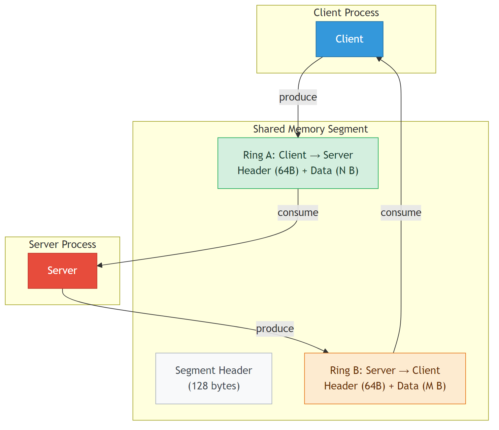
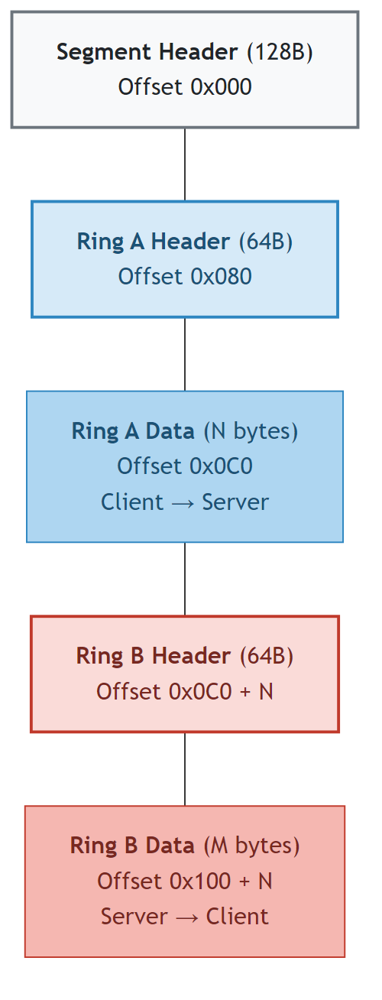
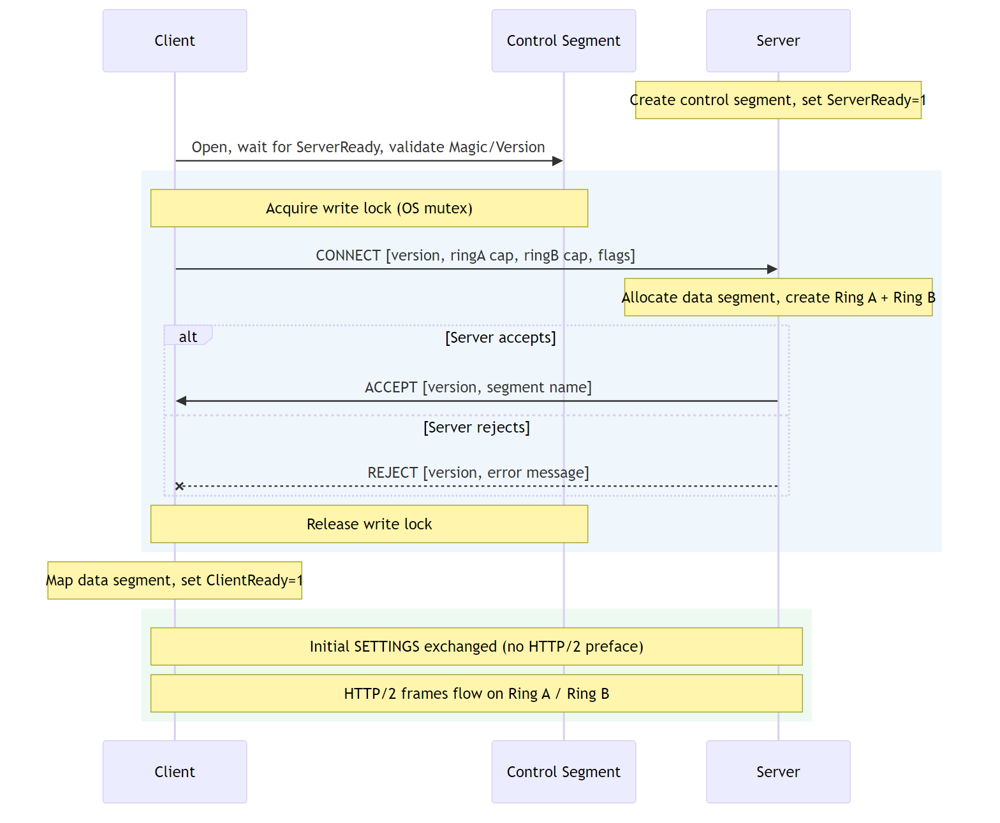

G3: Shared Memory Transport for gRPC
----
* Author(s): Mark Russinovich, Qiming Sun
* Approver: a11r
* Status: Draft
* Implemented in: n/a
* Last updated: 2026-05-06
* Discussion at: (TBD)

## Abstract

This proposal defines a protocol for gRPC over shared memory, for
inter-process calls on the same host. Two processes map the same memory
region and exchange gRPC frames through SPSC (single-producer /
single-consumer) ring buffers, using OS address-wait/wake primitives for
synchronization.

## Background

gRPC uses HTTP/2 over TCP. When both the client and server are on the same
host, the TCP path still traverses the full kernel networking stack — socket
buffers, TCP state machine, congestion control — which is unnecessary for
local IPC.
Even with HTTP/2 over a loopback or Unix domain socket, the transport still copies
bytes between user-space buffers and the kernel.

Shared memory lets two processes read and write the same physical pages
directly, allowing the receiver to parse frames in place without an intermediate copy.
This document specifies how HTTP/2 frames are carried over shared memory ring
buffers, together with the connection lifecycle.

### Related Proposals:

n/a

## Proposal

### Design Overview

Each SHM connection consists of a single memory-mapped segment containing two
unidirectional SPSC ring buffers:

- **Ring A**: Client → Server
- **Ring B**: Server → Client

The client writes to Ring A and reads from Ring B; the server does the
reverse. Multi-byte integers in the segment header, ring headers, and
control-segment frames are **little-endian**. HTTP/2 frames on the data
segment use the byte order defined by RFC 7540.

Frames carried on the data segment use HTTP/2 framing
([RFC 7540](https://httpwg.org/specs/rfc7540.html)) with HPACK
([RFC 7541](https://www.rfc-editor.org/rfc/rfc7541)), subject to the
constraints in [HTTP/2 Mapping](#http2-mapping). Stream multiplexing,
flow control, and keepalive follow HTTP/2 semantics. gRPC
[Length-Prefixed-Message](https://github.com/grpc/grpc/blob/master/doc/PROTOCOL-HTTP2.md)
encoding, status codes, metadata conventions, and compression negotiation
apply without modification.

The control segment uses a small SHM-specific framing, defined in
[Connection Establishment](#connection-establishment), for the one-time
CONNECT/ACCEPT exchange that brings up a data segment.



## Shared Memory Segment Layout

### Segment Header (128 bytes)

The segment header resides at offset 0 of the mapped region.

| Offset | Size | Field | Description |
|--------|------|-------|-------------|
| 0x00 | 8B | Magic | Fixed value `"GRPCSHM\0"` (0x47 52 50 43 53 48 4D 00) |
| 0x08 | 4B | Version | Protocol version (current = 1) |
| 0x0C | 4B | Flags | Reserved; MUST be 0 |
| 0x10 | 8B | TotalSize | Total mapped region size in bytes |
| 0x18 | 8B | RingAOffset | Byte offset to Ring A header |
| 0x20 | 8B | RingACapacity | Ring A data area capacity; MUST be a power of 2 |
| 0x28 | 8B | RingBOffset | Byte offset to Ring B header |
| 0x30 | 8B | RingBCapacity | Ring B data area capacity; MUST be a power of 2 |
| 0x38 | 4B | ServerPID | Server process ID |
| 0x3C | 4B | ClientPID | Client process ID |
| 0x40 | 4B | ServerReady | Server ready flag (0 or 1) |
| 0x44 | 4B | ClientReady | Client ready flag (0 or 1) |
| 0x48 | 4B | Closed | Connection closed flag (0 or 1) |
| 0x4C | 4B | Pad | Alignment padding |
| 0x50–0x7F | 48B | Reserved | MUST be 0 |

Implementations MUST validate Magic and Version after mapping. An
unrecognized Magic or Version MUST cause the mapping to be discarded.

**Ready flag rules:**

- The server sets `ServerReady = 1` after the segment is fully initialized.
  The client MUST NOT read any other header field until `ServerReady == 1`.
- The client sets `ClientReady = 1` after it has mapped the data segment and
  is prepared to receive frames.
- Both flags transition only from 0 → 1; the reverse is never valid.
- `Closed` in the **segment header** transitions only from 0 → 1 and
  indicates the connection is shutting down. Either side may set it. Once
  set, no new streams may be opened. Existing data already written to the
  rings SHOULD be consumed (drained) before unmapping, except when an
  abrupt error condition (such as receipt of GOAWAY with a non-zero error
  code or unrecoverable peer failure) makes drain impractical, in which
  case unprocessed ring data MAY be discarded.
- `Closed` in a **ring header** is set by that ring's producer (the side
  that writes to it) to indicate it will write no more data. The consumer
  MUST drain any remaining bytes before treating the ring as closed. The
  segment-level `Closed` flag is typically set after both rings are closed.
- All flag reads and writes MUST use acquire/release memory ordering.

### Ring Header (64 bytes)

Each ring buffer has a 64-byte header at the byte offset given by
`RingAOffset` or `RingBOffset` in the segment header.

| Offset | Size | Field | Description |
|--------|------|-------|-------------|
| 0x00 | 8B | Capacity | Data area capacity in bytes; power of 2 |
| 0x08 | 8B | WriteIdx | Monotonically increasing write index (producer) |
| 0x10 | 8B | ReadIdx | Monotonically increasing read index (consumer) |
| 0x18 | 4B | DataSeq | Data-available sequence (wait/wake target) |
| 0x1C | 4B | SpaceSeq | Space-available sequence |
| 0x20 | 4B | Closed | Ring closed flag; producer sets to 1 |
| 0x24 | 4B | Pad | Alignment padding |
| 0x28 | 4B | ContigSeq | Contiguity sequence (optional; see below) |
| 0x2C | 4B | SpaceWaiters | Writers blocked waiting for space |
| 0x30 | 4B | ContigWaiters | Writers blocked waiting for contiguity (optional) |
| 0x34 | 4B | DataWaiters | Readers blocked waiting for data |
| 0x38–0x3F | 8B | Reserved | MUST be 0 |

### Ring Data Area

Immediately following the ring header is a contiguous region of `Capacity`
bytes used as a circular buffer:

- Write position: `WriteIdx & (Capacity - 1)`
- Read position: `ReadIdx & (Capacity - 1)`
- Readable bytes: `WriteIdx - ReadIdx`
- Writable bytes: `Capacity - (WriteIdx - ReadIdx)`

### Overall Memory Layout

```
Offset 0:          Segment Header (128B)
Offset 128:        Ring A Header  (64B)     [Client → Server]
Offset 192:        Ring A Data    (N bytes, power-of-2)
Offset 192+N:      Ring B Header  (64B)     [Server → Client]
Offset 256+N:      Ring B Data    (M bytes, power-of-2)
```



## Transport Discovery

Before using shared memory, the client and server negotiate over an
existing HTTP/2 connection whether to switch to SHM. Discovery uses gRPC
metadata on any RPC:

1. The client sends initial metadata key `shm-offer` with an empty value.
2. If the server supports shared memory and the connection originates from
   the same host, the server includes trailing metadata key `shm-ctl` whose
   value is the control segment name.
3. The client opens the control segment and proceeds with the
   [Establishment Sequence](#establishment-sequence).

If the server does not return `shm-ctl`, or if the client fails to open
the control segment, the client continues using HTTP/2.

The negotiation is backward compatible. A server that does not
implement this protocol ignores the unknown `shm-offer` key (per standard
gRPC metadata handling) and never returns `shm-ctl`; the client stays on
HTTP/2. A client that does not implement this protocol never sends
`shm-offer`; the server does not push SHM. Either side may be upgraded
independently without breaking existing deployments.

`shm-offer` and `shm-ctl` are reserved metadata keys. Applications and
interceptors MUST NOT modify them. The discovered control segment name
applies to the lifetime of the HTTP/2 connection; the client SHOULD NOT
repeat discovery on the same connection. Discovery affects subsequent RPCs
on that connection, not the RPC carrying `shm-offer` itself.

### Control Segment Naming

The control segment name returned in `shm-ctl` SHOULD contain a
cryptographically random component to prevent name-guessing attacks.
Recommended format:

```
<server-id>_<uuid>_ctl
```

The server generates the name when it receives `shm-offer` and creates
the control segment before returning the trailing metadata.

### Same-Host Detection

The server SHOULD verify that the client is on the same host before
returning `shm-ctl`. The verification method is implementation-defined.

## Connection Establishment

### Control Segment

Connection establishment uses a shared control segment. The control
segment name is provided by the server during
[Transport Discovery](#transport-discovery) or through an out-of-band
mechanism. The control segment uses the same binary layout as a data
segment; fields that are connection-specific (ClientPID, ClientReady)
apply to the current exchange only and are reset between connections.

The control segment is shared among all clients connecting to the same
server. Because Ring A of the control segment may receive CONNECT frames
from multiple client processes, the SPSC assumption does not hold on this
ring. Implementations MUST serialize writes to Ring A using an OS-level
mutual exclusion primitive tied to the control segment name:

- **Linux / POSIX**: advisory lock (`flock`) on the control segment's
  backing file.
- **Windows**: a named mutex whose name is the control segment name with
  a `.lock` suffix (e.g. if the control segment is `grpc_ctl`, the mutex
  is `grpc_ctl.lock`).

The client acquires the lock before writing CONNECT and releases it after
reading ACCEPT or REJECT. While the lock is held, the holding client is
the sole reader of Ring B; other clients MUST NOT read or advance Ring B
state. Both rings are therefore single-producer / single-consumer for
the duration of each exchange.

### Control Frame Envelope

Each control frame begins with a fixed 16-byte header followed by an
opaque payload:

| Offset | Size | Field | Description |
|--------|------|-------|-------------|
| 0x00 | 4B | Length | Payload length in bytes, not counting the 16-byte header |
| 0x04 | 4B | StreamID | MUST be 0 for all control frames |
| 0x08 | 1B | Type | Frame type (see below) |
| 0x09 | 1B | Flags | MUST be 0 |
| 0x0A | 6B | Reserved | MUST be 0 |

Multi-byte fields are little-endian (consistent with the rest of the
control segment). Defined Type values:

| Value | Name |
|-------|------|
| 0x10 | CONNECT |
| 0x11 | ACCEPT |
| 0x12 | REJECT |

The payload encodings for each Type are defined below.

### Control Frame Payloads

#### CONNECT Payload (18 bytes)

```
Version(1B) | RingACapacity(8B LE) | RingBCapacity(8B LE) | Flags(1B)
```

- Version: control-frame encoding version (current = 1). This is
  independent of the segment header Version field, which describes the
  segment binary layout.
- RingACapacity / RingBCapacity: client's preferred ring sizes in bytes.
  A value of 0 means "use the server's default." The server is free to
  choose smaller capacities.
- Flags: bitfield for connection options. Defined bits:

  | Bit | Name | Description |
  |-----|------|-------------|
  | 0 | SINGLE_STREAM | Client requests single-stream mode (see below) |
  | 1–7 | (reserved) | |

  Senders MUST set reserved flag bits to 0. Receivers MUST ignore
  unknown flag bits for forward compatibility.

  `SINGLE_STREAM` is a hint that the client will not open more than one
  concurrent stream. It does not appear on the wire after CONNECT; the
  server signals acceptance by advertising
  `SETTINGS_MAX_CONCURRENT_STREAMS = 1` in its initial SETTINGS frame on
  the data segment. The hint allows the server to skip per-stream
  scheduling state. Setting the bit does not change frame syntax: the
  client MUST still emit valid HTTP/2 frames with non-zero StreamID for
  RPCs.

#### ACCEPT Payload (variable)

```
Version(1B) | NameLen(4B LE) | DataSegmentName(var, UTF-8)
```

Contains the name of the data segment the server has allocated. After
receiving ACCEPT, the client maps the named segment. The negotiated ring
capacities are read from the data segment's header.

#### REJECT Payload (variable)

```
Version(1B) | MsgLen(4B LE) | ErrorMessage(var, UTF-8)
```

The connection attempt has failed; ErrorMessage is diagnostic text.

The Version field in CONNECT, ACCEPT, and REJECT identifies the control-
frame encoding version. A receiver that does not recognize the Version
MUST respond with REJECT (when reading CONNECT) or treat the response as
a connection failure (when reading ACCEPT or REJECT) and continue using
HTTP/2.

### Establishment Sequence



1. Server creates the control segment and sets `ServerReady = 1`.
2. Client opens the control segment. It MUST wait until `ServerReady == 1`
   and then validate Magic and Version.
3. Client acquires the control-segment write lock and sends CONNECT on
   Ring A.
4. Server reads CONNECT, allocates a data segment, and responds with ACCEPT
   (or REJECT) on Ring B.
5. Client reads the response and releases the write lock.
6. Client maps the data segment and sets `ClientReady = 1` in the **data**
   segment header.
7. HTTP/2 frames begin flowing on Ring A and Ring B of the data segment,
   starting with each side's initial SETTINGS frame (see
   [Connection Preface](#connection-preface)).

### Security Handshake

The base protocol does not require a security handshake. A future document
may define one to be performed on the data segment after Connection
Establishment but before any HTTP/2 frames are exchanged. Implementations
that do not support such a handshake interoperate with peers that also
omit it.

## HTTP/2 Mapping

Frames carried on the data segment use HTTP/2 framing as defined in
[RFC 7540](https://httpwg.org/specs/rfc7540.html), with HPACK header
compression as defined in [RFC 7541](https://www.rfc-editor.org/rfc/rfc7541),
subject to the constraints in this section. The control segment uses the
SHM-specific framing defined in [Connection Establishment](#connection-establishment)
and is not subject to these rules.

### Framing on the Ring

HTTP/2 frame parsing on this transport is byte-stream oriented and
identical to HTTP/2 over any other transport. A frame's 9-byte header and
its payload MAY be produced and consumed across multiple ring write or
read operations. Receivers MUST process frame bytes incrementally;
senders MAY advance `WriteIdx` mid-frame so that the receiver can begin
draining payload while the rest is still being written.

Ring capacity is therefore independent of `MAX_FRAME_SIZE`. A ring
smaller than the peer's advertised `MAX_FRAME_SIZE` is well-formed; a
frame whose total size exceeds ring capacity is carried by alternating
writer-blocks-on-space and reader-blocks-on-data through the
[Wait/Wake](#waitwake) mechanism.

### Frame Set

| Frame | Used | Notes |
|-------|------|-------|
| DATA (0x0) | yes | Carries gRPC Length-Prefixed-Message bytes |
| HEADERS (0x1) | yes | Initial headers; trailers carry END_STREAM |
| PRIORITY (0x2) | ignored | Stream prioritization is not used; receivers MUST silently ignore |
| RST_STREAM (0x3) | yes | Stream cancellation |
| SETTINGS (0x4) | yes | Negotiation; ACK MUST be sent per RFC 7540 |
| PUSH_PROMISE (0x5) | not used | gRPC does not use server push |
| PING (0x6) | yes | Keepalive |
| GOAWAY (0x7) | yes | Connection shutdown |
| WINDOW_UPDATE (0x8) | yes | See [Flow Control](#flow-control) |
| CONTINUATION (0x9) | yes | Sent when a header block exceeds the peer's MAX_FRAME_SIZE |

Senders MUST NOT emit PRIORITY or PUSH_PROMISE frames. Receipt of a
PUSH_PROMISE frame is a connection error of type `PROTOCOL_ERROR`
(RFC 7540 §6.6).

### Connection Preface

The HTTP/2 connection preface (`PRI * HTTP/2.0\r\n\r\nSM\r\n\r\n`) MUST NOT
be used. The Connection Establishment handshake on the control segment has
already established a peer relationship by the time the data segment is
mapped.

After [Establishment Sequence](#establishment-sequence) step 7, both peers
MUST send a SETTINGS frame as the first HTTP/2 frame on their respective
data-segment ring, and MUST acknowledge the peer's SETTINGS with a
SETTINGS frame carrying the ACK flag.

### SETTINGS

The following parameters apply to this transport. The defaults below
apply to parameters not explicitly advertised:

| Parameter | Default | Purpose |
|-----------|---------|---------|
| HEADER_TABLE_SIZE (0x1) | 0 | Disable HPACK dynamic table; MUST be 0 (see [HPACK](#hpack)) |
| ENABLE_PUSH (0x2) | 0 | Server push is not used; MUST be 0 |
| MAX_CONCURRENT_STREAMS (0x3) | unlimited | Server-defined; clients MUST honor when advertised |
| INITIAL_WINDOW_SIZE (0x4) | 2,147,483,647 (2³¹ − 1) | See [Flow Control](#flow-control) |
| MAX_FRAME_SIZE (0x5) | 16,777,215 (2²⁴ − 1) | Maximum permitted by RFC 7540 |
| MAX_HEADER_LIST_SIZE (0x6) | 1,048,576 (1 MiB) | Bound on header list size |

For parameters other than HEADER_TABLE_SIZE and ENABLE_PUSH, a peer MAY
advertise smaller values. Senders MUST honor the peer's advertised
values per RFC 7540 §6.5.

### HPACK

Senders MUST NOT add entries to a dynamic table; receivers MUST NOT use
dynamic-table state. With `HEADER_TABLE_SIZE = 0` advertised, a receiver
MUST treat any reference to an index above the static table size (61,
defined in RFC 7541 Appendix A) as a connection error of type
COMPRESSION_ERROR.

Senders MAY use Huffman encoding for string literals. Receivers MUST
support Huffman decoding.

### Length-Prefixed Message over DATA

Each gRPC application message is encoded as a 5-byte
[Length-Prefixed-Message](https://github.com/grpc/grpc/blob/master/doc/PROTOCOL-HTTP2.md)
header (`Compressed-Flag(1) | Message-Length(4 BE)`) followed by
`Message-Length` bytes of message body. This byte stream is carried in one
or more DATA frames. A single DATA frame MAY carry:

- one complete LPM message,
- a fragment of one LPM message (when the encoded message exceeds
  MAX_FRAME_SIZE), or
- multiple complete LPM messages.

Receivers MUST handle all three cases. Senders SHOULD emit one application
message per DATA frame so that receivers can apply zero-copy optimizations
on the common case.

When the encoded message exceeds the peer's MAX_FRAME_SIZE, the sender
splits it into the minimum number of DATA frames needed. END_STREAM, if
applicable, is set on the last DATA frame.

### CONTINUATION

Receivers MUST handle CONTINUATION frames per RFC 7540. Senders MUST emit
CONTINUATION when a header block exceeds the peer's advertised
MAX_FRAME_SIZE.

### PADDED Frames

The PADDED flag on DATA and HEADERS frames MUST be supported on the read
path. Senders SHOULD NOT set PADDED.

### Stream Lifecycle

Stream ID allocation, stream states, and state transitions follow
[RFC 7540 Section 5.1](https://httpwg.org/specs/rfc7540.html#StreamStates),
including the handling of frames received on closed streams.

### Flow Control

Stream-level flow control follows the HTTP/2 WINDOW_UPDATE model
(RFC 7540 §6.9) with `INITIAL_WINDOW_SIZE = 2³¹ − 1`. WINDOW_UPDATE
frames are read and processed per the spec; with the maximum initial
window, back-pressure is provided by the shared memory ring (writer
blocks when the ring is full, reader blocks when it is empty, signaled
via the wait/wake primitives in [Wait/Wake](#waitwake)).

The HTTP/2 connection-level flow-control window starts at 65,535
(RFC 7540 §6.9.2) and is not affected by `SETTINGS_INITIAL_WINDOW_SIZE`.
To prevent the connection window from constraining throughput,
immediately after sending its initial SETTINGS frame each peer MUST
send a WINDOW_UPDATE frame with stream identifier 0 and an increment of
`2,147,418,112` (`2³¹ − 1 − 65535`), raising the connection-level
window to `2³¹ − 1`.

Both connection-level and stream-level windows decrement as DATA frames
are sent. Receivers SHOULD send WINDOW_UPDATE frames as bytes are
consumed so that neither window becomes the limiting back-pressure
mechanism; in the steady state, back-pressure is provided by ring
occupancy via [Wait/Wake](#waitwake), not by HTTP/2 windows.
Implementations MAY keep both windows near `2³¹ − 1`. WINDOW_UPDATE
frames are processed per RFC 7540.

## Synchronization

### SPSC Ring Contract

- The producer MUST only write `WriteIdx`; the consumer MUST only write
  `ReadIdx`.
- Updates to `WriteIdx` and `ReadIdx` MUST use release semantics; reads MUST
  use acquire semantics.
- All bytes in the range about to be published MUST be written before
  `WriteIdx` is advanced past them. A producer MAY publish a frame
  incrementally (see [Framing on the Ring](#framing-on-the-ring)).

### Wait/Wake

When the ring is empty or full, the protocol uses address-wait primitives
provided by the OS to avoid busy-waiting. The portable abstraction is:

- **WaitOnAddress(addr, expected)**: block until `*addr != expected`.
- **WakeByAddress(addr)**: unblock one thread waiting on `addr`.

Concrete mappings:

| Operation | Linux | Windows |
|-----------|-------|---------|
| Wait | `futex(addr, FUTEX_WAIT, expected)` | `WaitOnAddress(addr, expected, 4)` |
| Wake | `futex(addr, FUTEX_WAKE, 1)` | `WakeByAddressSingle(addr)` |

The `DataSeq` and `SpaceSeq` fields are the primary wait/wake target
addresses. After writing data, the producer increments `DataSeq` and wakes
if `DataWaiters > 0`. After consuming data, the consumer increments
`SpaceSeq` and wakes if `SpaceWaiters > 0`. The `ContigSeq` and
`ContigWaiters` fields are reserved for implementations that require
contiguous (non-wrapping) frame placement and need an additional wait/wake
target for that condition. Implementations that allow frame payloads to
wrap around the end of the data area need not use these fields.

To avoid lost wakes, a waiter MUST increment the waiter count and re-check
the ring condition before entering the wait syscall.

### Adaptive Spin-Then-Block

Before falling back to a kernel wait, implementations SHOULD spin for a
bounded number of iterations.

## Ring Sizing

Ring capacity SHOULD be sized to the expected concurrency and frame rate,
not to the maximum message size; correctness across ring sizes is
guaranteed by [Framing on the Ring](#framing-on-the-ring). Capacities in
the 64 KiB to 4 MiB range are sufficient for typical gRPC workloads;
larger rings help with concurrent stream count rather than per-stream
throughput.

## Security Considerations

### Threat Model

SHM transport runs on a single host. Its security model relies on OS
process isolation, similar to Unix domain sockets. The protocol does not
defend against a malicious process that already has permission to map the
shared memory region.

### Segment Names

Control segment names SHOULD contain a cryptographically random component
(see [Control Segment Naming](#control-segment-naming)). A predictable
name allows a rogue process to pre-create a segment with the same name and
intercept connections.

### File Permissions

The shared memory backing file SHOULD be readable and writable only by
processes that need access. When server and client run as the same OS user,
Linux file mode 0600 is sufficient. Cross-user deployments require broader
permissions (e.g. a shared group), which increases the attack surface.

### Data Confidentiality and Integrity

Segment contents are neither encrypted nor signed. Any process with
mapping permission can read and write arbitrary bytes. Deployments that
require confidentiality SHOULD restrict access through OS file permissions
rather than protocol-level encryption, which would negate the performance
benefit of shared memory.

### Process Identity

The ServerPID and ClientPID fields in the segment header are informational
and MUST NOT be used for authentication (PIDs may be recycled). Process
authentication beyond PID is deferred to the security handshake described
in [Security Handshake](#security-handshake).

### Denial of Service

A malicious client may hold the control-segment write lock indefinitely,
preventing other clients from connecting. Implementations SHOULD apply a
timeout when acquiring the lock. A malicious peer may also fill the ring
without reading, causing the other side to block on writes; ring-level
backpressure is inherent to the protocol.

## Implementation

The protocol requires a platform that supports:

- Memory-mapped files shared between processes.
- An address-wait/wake primitive (e.g. Linux `futex`, Windows
  `WaitOnAddress`).

## Open issues (if applicable)

* **macOS support.** macOS does not provide `futex`. Possible alternatives
  include `os_unfair_lock`, `pthread` condition variables, and
  `dispatch_semaphore`; their suitability has not yet been evaluated.

* **ARM64 memory ordering.** The protocol specifies acquire/release semantics.
  On x86-64 these are implicit under TSO, but ARM64 implementations need
  explicit barriers.

* **Cross-container IPC.** Containers isolate IPC namespaces by default.
  Shared memory between containers requires either a shared IPC namespace or
  a volume pointing to the same backing file.

* **Stale segment cleanup.** If a server process crashes, its shared memory
  backing files and lock files may remain on disk. Cleanup of stale
  segments is implementation-defined.
